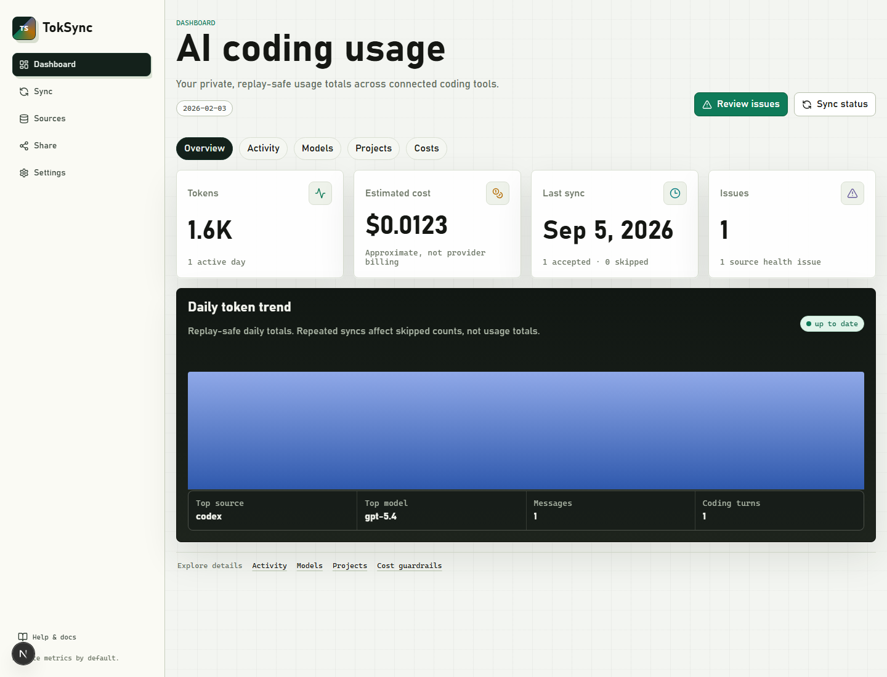

<p align="center">
  
</p>

<h1 align="center">TokSync</h1>

<p align="center">
  Private-first AI coding usage sync for Codex CLI, Claude Code, OpenCode,
  Cursor, Copilot, Gemini CLI, and OpenClaw.
  Metrics move across devices; prompts, replies, tool output, secrets, and raw
  project paths do not.
</p>

<p align="center">
  <a href="./README.zh-CN.md">中文</a>
  ·
  <a href="#quick-start">Quick start</a>
  ·
  <a href="#privacy-contract">Privacy contract</a>
  ·
  <a href="#roadmap-boundaries">Roadmap boundaries</a>
</p>

<p align="center">
  
  
  
  
</p>

## What TokSync Is

TokSync v0.5 is a local-first telemetry hub for AI coding tools. It aggregates
token counts, approximate cost, model, source, device, and workspace-label usage
across machines while keeping private content out of the sync payload.

The product direction follows Tokscale's strong usage/profile/README embed loop,
but TokSync's default path is private multi-device aggregation. Public profile,
README badge/card, and leaderboard remain explicit opt-in layers.

Product defaults are hosted-first and privacy-first: initial production
deployment targets a hosted SaaS, while the repo keeps env, migration, and
export boundaries compatible with later self-hosting. Production login starts
with GitHub OAuth; email magic link is deferred. Leaderboard scope is global
only, with no source/model subboards.

## Current Console

| Surface            | Current behavior                                                                                                                                               |
| ------------------ | -------------------------------------------------------------------------------------------------------------------------------------------------------------- |
| Local agent        | `login`, token login, `status`, `sources list`, receipt dry-run, encrypted local device-token fallback                                                         |
| Collectors         | Codex CLI, Claude Code, OpenCode, Cursor CSV, Copilot OTEL JSONL, Gemini tmp chats, OpenClaw session/SDK usage logs                                            |
| API                | GitHub OAuth, device login, user API tokens, receipts, health, merge, export, guardrails, leaderboard, vault, Proof Pack, Wrapped, Redis-capable rate limiting |
| Storage            | `FileTokSyncStore` at `.tmp/toksync-dev.json` by default                                                                                                       |
| Web                | Dashboard, devices, health, receipts, merge, budgets, local viewer, leaderboard, usage vault, Proof Pack, Wrapped, CSP/security headers                        |
| Public output      | README badge/profile-card SVG, Public Proof Pack, and public Wrapped card from public cache / receipt digest only                                              |
| Verification stack | Vitest, Playwright E2E, visual smoke, perf smoke, Turbo checks                                                                                                 |

## Quick Start

```bash
pnpm install
cp .env.example .env
pnpm db:reset
pnpm db:seed
pnpm dev
```

Local browser/dev auth is explicit. Keep `TOKSYNC_DEV_AUTH=1` in `.env` for
`--auto-authorize demo` and `X-TokSync-User` based local Web requests; leave it
unset or `0` for hosted/prod-like auth checks. Device codes default to 900
seconds and can be tuned with `DEVICE_CODE_TTL_SECONDS`.

In another terminal:

```bash
pnpm agent login --auto-authorize demo
pnpm agent sync --dry-run --fixture ./packages/test-fixtures/codex/basic
pnpm agent sync --fixture ./packages/test-fixtures/codex/basic
```

The first sync inserts usage events. Repeating the same sync should skip the
same events instead of double-counting totals.

Headless/private sync can use a user API token created from settings or the API:

```bash
pnpm agent login --token tsk_...
TOKSYNC_API_TOKEN=tsk_... pnpm agent sync --fixture ./packages/test-fixtures/codex/basic
```

`TOKSYNC_API_TOKEN` is treated as a one-shot process input and is cleared from
the current agent process after it is read. Device login stores `deviceToken` as
`deviceTokenEncrypted` in `config.json` with AES-256-GCM and a local
`config.key`; legacy plaintext config files load and migrate on the next save.

Default local services:

| Service | URL                   |
| ------- | --------------------- |
| Web     | http://localhost:3000 |
| API     | http://localhost:4000 |
| Worker  | http://localhost:4100 |

## Architecture

```text
apps/
  agent/       Commander CLI sync agent
  api/         Hono API service
  web/         Next.js App Router UI
  worker/      Worker/health surface

packages/
  shared/      Zod contracts, source ids, formatting, shared errors
  collector-core/
               Source discovery and UsageEventV1 normalization
  privacy/     Workspace hashing and metrics-only guards
  pricing/     Approximate cost estimation
  db/          Repository, local JSON store, migrations, seed/reset scripts
  embed-renderer/
               SVG badge and profile-card renderer
  test-fixtures/
               Synthetic parser fixtures
```

The active local store is `FileTokSyncStore`, controlled by `TOKSYNC_DB_FILE`.
`packages/db/migrations/0001_v0_1_metrics.sql` is the current forward SQL shape
for the hosted Postgres target, including the `vault_exports` ledger. Vault
artifacts stay inline in the local file store by default, or can be written to a
private object directory with `TOKSYNC_VAULT_ARTIFACT_DIR`.

API rate limiting uses an in-process store for local development. Set
`TOKSYNC_RATE_LIMIT_REDIS_URL=redis://...` or `rediss://...` before
multi-instance hosted deployment to share counters across instances.

## Privacy Contract

- Public profile is disabled by default.
- README badge/profile-card, Public Proof Pack, and public Wrapped endpoints read public aggregate state or receipt digest only.
- Public output must not expose device names, raw paths, workspace hashes,
  source session ids, message ids, message text, tool arguments, or tool output.
- Workspace/project labels are private by default and may appear in public
  output only after an explicit user allow decision.
- Device fingerprinting must not derive from hardware identifiers, hostname,
  username, home path, or project path.
- Cost is approximate usage estimation, not provider billing truth.
- Cost Guardrails are private-only and never feed public profile, README SVG, or
  leaderboard output.
- Leaderboard participation requires public profile plus a second explicit
  opt-in, reads public aggregate cache only, and is global-only.
- Private Usage Vault encrypts metrics-only artifacts with a user recovery
  passphrase of at least 16 characters; new exports record explicit scrypt
  parameters and can be downloaded/imported across instances with idempotent
  duplicate handling.
- Content sync, search, and eval export remain future opt-in features, not
  current behavior.

## Roadmap Boundaries

The external specs track Tokscale parity and TokSync-specific governance
features. The v0.2 private governance slice is implemented locally, v0.3 adds
the first cost-governance and public leaderboard cut, v0.4 adds a portable
metrics vault plus real-format source parity adapters, and v0.5 turns Public
Proof Pack / Wrapped into visible app surfaces backed by public-safe API
contracts:

| Phase | Planned capability   | Boundary                                                                                                    |
| ----- | -------------------- | ----------------------------------------------------------------------------------------------------------- |
| v0.1  | Public label privacy | Implemented as private-by-default labels with explicit public toggle and safe-label filtering               |
| v0.2  | Merge Copilot        | Implemented as private duplicate-run summaries                                                              |
| v0.2  | Sync Privacy Receipt | Implemented with digest and safe field groups                                                               |
| v0.2  | Source Health Radar  | Implemented for source sync status/freshness                                                                |
| v0.2  | GitHub OAuth         | Implemented as first production browser login; email magic link deferred                                    |
| v0.2  | User API token       | Implemented for private/headless metrics sync                                                               |
| v0.2  | Metrics export       | Implemented JSON/CSV without private IDs                                                                    |
| v0.3  | Cost Guardrails      | Implemented for private budget, spike, unknown-pricing alerts                                               |
| v0.3  | Leaderboard          | Implemented global-only; source/model subboard queries are rejected                                         |
| v0.4  | Source parity        | Implemented Cursor usage CSV, Copilot OTEL, Gemini tmp chats, and OpenClaw usage log parsing                |
| v0.4  | Private Usage Vault  | Implemented passphrase-encrypted metrics backup, artifact storage, preview, and import                      |
| v0.4+ | Stabilization gate   | FileStore repository mutation transactions, parser/component coverage, token encryption, Redis limit switch |
| v0.5  | Public Proof Pack    | Implemented API and `/app/proof-pack` console from public aggregates plus receipt digests                   |
| v0.5  | Wrapped              | Implemented `/app/wrapped`, private summary, and public low-sensitivity Wrapped card                        |

Billing, subscriptions, payment providers, plan limits, billing UI, content
sync, search, eval export, and source/model leaderboard subboards remain out of
scope.

## Useful Commands

```bash
pnpm format:check
pnpm check:boundaries
pnpm typecheck
pnpm lint
pnpm test
pnpm test:coverage
pnpm build
pnpm test:e2e
pnpm test:visual
pnpm test:perf
pnpm test:full
```

Database/dev data:

```bash
pnpm db:reset
pnpm db:seed
pnpm db:migrate
```

Agent examples:

```bash
pnpm agent status
pnpm agent sources list
pnpm agent logout
TOKSYNC_CONFIG_DIR=.tmp/toksync-agent pnpm agent status
```

## Project Docs

- Product specs: `E:\Project Code\docs\01 - Projects\TokSync`
- Current feature guide:
  `E:\Project Code\docs\01 - Projects\TokSync\03 - Guides\当前功能与使用指南.md`
- Latest docs change list:
  `E:\Project Code\docs\01 - Projects\TokSync\01 - Product\TokSync 文档变更清单.md`
- Agent guide: `AGENTS.md`

When external docs and code disagree, treat the docs as product intent and the
repository as current implementation truth. Update both when changing product
scope, API contracts, privacy boundaries, or data shape.
